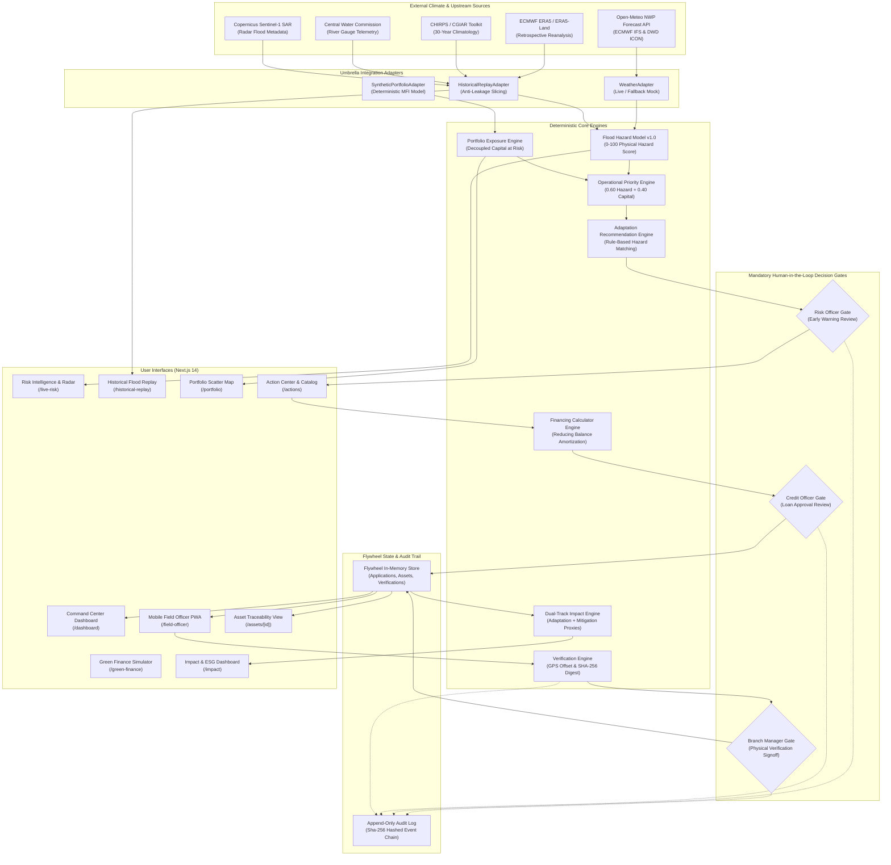
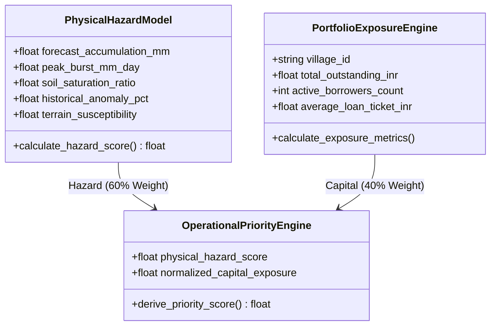
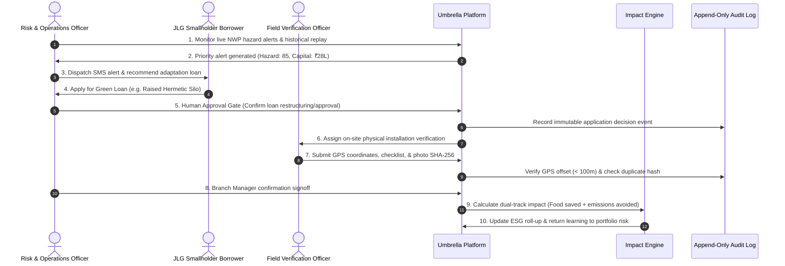

# Umbrella System Architecture (Final Pre-Submission Specification)

**Platform:** Umbrella Climate-Adaptive Microfinance Platform  
**Target Repository:** `TeamArclight/Umbrella`  
**Architecture Paradigm:** Decoupled Closed-Loop Climate Adaptation Flywheel  
**Current Release:** v0.1.0-sankalp-demo  

---

## 1. High-Level Architectural Diagram

The diagram below illustrates the end-to-end data flow, separating physical climate observation, financial portfolio exposure, human decision gates, field operations, and impact estimation:

---

## 2. Core Engine Decoupling Axiom

The mathematical core of Umbrella is founded on strict separation between physical hazard and financial capital:

$$\mathbf{Physical\ Climate\ Hazard\ (0-100) \neq Portfolio\ Capital\ Exposure\ (\text{₹}) \neq Credit\ Default\ Risk}$$

---

## 3. The 7-Stage Closed-Loop Flywheel

Umbrella operationalizes the Economics of Climate Adaptation (ECA) framework across a continuous closed-loop cycle:

---

## 4. Key Subsystem Specifications

### 4.1 Weather & Replay Adapters
- **Live Mode**: Calls `https://api.open-meteo.com/v1/forecast` using asynchronous HTTP. Extracts 3, 5, and 7-day precipitation sums, peak 24-hour bursts, 2m temperature extremes, and topsoil volumetric moisture (0–10 cm).
- **Fallback Mode**: Deterministic, verified mock tables activate automatically upon network timeout or rate limiting, with `data_source_mode = "MOCK"`.
- **Anti-Leakage Replay**: Restricts input slices to $t \le T_{\text{snapshot}}$, strictly preventing future data leakage during historical evaluation.

### 4.2 Recommendation & Green Finance Engines
- **Recommendation Engine**: Rule-based matching between hazard severity (`MODERATE`, `HIGH`, `SEVERE`), dominant crop type (paddy, makhana, vegetables), and borrower livelihood.
- **Financing Calculator**: Monthly reducing-balance EMI calculations with transparent disclosure of principal, interest, upfront processing fees, and operational payback periods.

### 4.3 Field Verification & Tamper Prevention
- **Haversine GPS Verification**: Evaluates spherical distance between field officer device coordinates and cadastral homestead records. Offsets $\le 100\text{ m}$ receive a `PASSED` rating.
- **SHA-256 Duplicate Check**: Prevents reuse of past installation photos across multiple loan applications.

### 4.4 Append-Only Audit Trail
- Every state transition across applications, assets, and verifications generates a structured `AuditEvent` containing an event ID, entity ID, action type, actor ID, timestamp, and metadata payload.
- The log is append-only, providing end-to-end traceability for internal audits and regulatory inspections.
